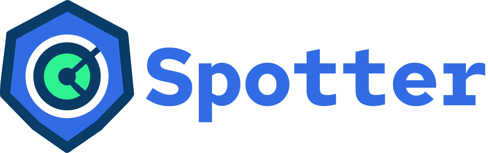

<div align="center">
  <p align="center"><a href="https://spotter.run" rel="spotter.run"></a></p>
  <p align="center">⚡️Universal Kubernetes Security Engine</p>
</div>

<div align="center">

[](https://goreportcard.com/report/github.com/madhuakula/spotter)
[](https://github.com/madhuakula/spotter/blob/main/LICENSE)
[](https://github.com/madhuakula/spotter/releases)
[](https://deepwiki.com/madhuakula/spotter)

</div>

**Spotter** is a comprehensive Kubernetes security scanner that helps identify security misconfigurations, vulnerabilities, and compliance issues in your Kubernetes clusters and manifests. Built with extensibility and performance in mind, Spotter uses the Common Expression Language (CEL) for flexible rule definitions and supports multiple output formats including SARIF for seamless CI/CD integration.

## 📋 Table of Contents

- [Quick Start](#-quick-start)
- [Architecture](#-architecture)
- [Features](#-features)
- [Configuration](#-configuration)
- [Security Categories](#-security-categories)
- [Rule Development](#-rule-development)
- [Contributing](#-contributing)
- [Documentation](#-documentation)

## 🚀 Quick Start

### Installation

#### Using Go Install
```bash
go install github.com/madhuakula/spotter@latest
```

#### Using Docker
```bash
docker pull ghcr.io/madhuakula/spotter:latest
```

#### Download Binary
Download the latest release from [GitHub Releases](https://github.com/madhuakula/spotter/releases).

### Basic Usage

#### Scan Kubernetes Manifests
```bash
# Scan a single manifest file
spotter scan manifests --path deployment.yaml

# Scan a directory of manifests
spotter scan manifests --path ./k8s-manifests/

# Scan with custom rules
spotter scan manifests --path ./manifests/ --rules ./custom-rules/

# Output in JSON format
spotter scan manifests --path ./manifests/ --output json
```

#### Scan Live Kubernetes Cluster
```bash
# Scan current cluster context
spotter scan cluster

# Scan specific namespace
spotter scan cluster --namespace production

# Scan with specific kubeconfig
spotter scan cluster --kubeconfig ~/.kube/config
```

#### Rule Management
```bash
# List available rules
spotter rules list

# Validate custom rules
spotter rules validate --path ./custom-rules/

# Show rule details
spotter rules show --id SPOTTER-WORKLOAD-SECURITY-101
```

## 📖 Documentation

### User Guides
- [Installation Guide](docs/installation.md) - Detailed installation instructions
- [User Guide](docs/user-guide.md) - Comprehensive usage documentation
- [Configuration Guide](docs/configuration.md) - Configuration options and examples
- [Rules Guide](docs/rules.md) - Understanding and creating security rules

## 🏗️ Architecture

Spotter follows a modular architecture designed for extensibility and performance:

```
  ┌─────────────────┐    ┌─────────────────┐    ┌─────────────────┐
  │   CLI Layer     │    │   Config Layer  │    │  Output Layer   │
  │                 │    │                 │    │                 │
  │ • Commands      │    │ • YAML Config   │    │ • Table         │
  │ • Flags         │    │ • Validation    │    │ • JSON          │
  │ • Help          │    │ • Defaults      │    │ • SARIF         │
  └─────────────────┘    └─────────────────┘    └─────────────────┘
          │                       │                       │
          └───────────────────────┼───────────────────────┘
                                  │
┌─────────────────────────────────┼─────────────────────────────────┐
│                        Core Engine                                │
│                                                                   │
│  ┌─────────────┐  ┌─────────────┐  ┌─────────────┐  ┌───────────┐ │
│  │  Scanner    │  │    Rules    │  │   Reporter  │  │  Metrics  │ │
│  │             │  │             │  │             │  │           │ │
│  │ • Manifest  │  │ • Built-in  │  │ • Formatter │  │ • Timing  │ │
│  │ • Cluster   │  │ • Custom    │  │ • Writer    │  │ • Counts  │ │
│  │ • Workers   │  │ • CEL       │  │ • Streaming │  │ • Errors  │ │
│  └─────────────┘  └─────────────┘  └─────────────┘  └───────────┘ │
└───────────────────────────────────────────────────────────────────┘
         │                       │                       │
┌─────────────────┐    ┌─────────────────┐    ┌─────────────────┐
│  Data Sources   │    │   Rule Engine   │    │   Integrations  │
│                 │    │                 │    │                 │
│ • YAML Files    │    │ • CEL Evaluator │    │ • Kubernetes    │
│ • Kubernetes    │    │ • Rule Matcher  │    │ • CI/CD         │
│ • Directories   │    │ • Validation    │    │ • Monitoring    │
└─────────────────┘    └─────────────────┘    └─────────────────┘
```

## 🚀 Features

### 🔒 Security Scanning
- **Comprehensive Rule Set**: Built-in security rules covering OWASP Kubernetes Top 10, CIS Kubernetes Benchmark, and NSA/CISA guidelines
- **Custom Rules**: Define your own security rules using CEL expressions
- **Multi-Resource Support**: Scan Pods, Deployments, Services, ConfigMaps, Secrets, and more
- **Real-time Cluster Scanning**: Connect to live Kubernetes clusters for runtime security assessment

### 🚀 Performance & Scalability
- **Concurrent Processing**: Multi-threaded scanning for large clusters and manifest collections
- **Memory Efficient**: Optimized for scanning large numbers of resources
- **Configurable Workers**: Tune performance based on your environment

### 📊 Flexible Output
- **Multiple Formats**: Table, JSON, YAML, and SARIF output formats
- **CI/CD Integration**: SARIF support for GitHub Security tab and other security platforms
- **Detailed Reports**: Comprehensive violation details with remediation guidance
- **Severity Levels**: CRITICAL, HIGH, MEDIUM, and LOW classifications

### 🔧 Developer Experience
- **CLI Interface**: Intuitive command-line interface with comprehensive help
- **Configuration Files**: YAML-based configuration for consistent scanning
- **Extensible Architecture**: Plugin-based design for custom scanners and reporters
- **Rich Documentation**: Comprehensive guides for users and contributors

### Key Components

- **Scanner**: Handles resource discovery and processing
- **Rule Engine**: Evaluates CEL expressions against Kubernetes resources
- **Reporter**: Formats and outputs scan results
- **Config Manager**: Manages configuration and rule loading
- **Metrics**: Collects performance and usage statistics

## 🔧 Configuration

Spotter can be configured using YAML files, environment variables, or command-line flags:

```yaml
# spotter.yaml
logging:
  level: info
  format: text

scanner:
  workers: 4
  timeout: 300s
  include_namespaces: ["production", "staging"]
  exclude_namespaces: ["kube-system"]

rules:
  builtin_enabled: true
  custom_paths:
    - "./custom-rules/"
    - "/etc/spotter/rules/"
  severity_filter: ["CRITICAL", "HIGH", "MEDIUM"]

output:
  format: table
  verbose: false
  file: "scan-results.json"

kubernetes:
  kubeconfig: "~/.kube/config"
  context: "production-cluster"
  timeout: 30s
```

## 🛡️ Security Rules

Spotter includes comprehensive built-in security rules and supports custom rule creation:

### Built-in Rule Categories

- Workload Security
- Access Control
- Network & Traffic Security
- Secrets & Data Protection
- Configuration & Resource Hygiene
- Supply Chain & Image Security
- CI/CD & GitOps Security
- Runtime Threat Detection
- Audit, Logging & Compliance
- Platform & Infrastructure Security

### Custom Rule Example

```yaml
apiVersion: rules.spotter.run/v1
kind: SecurityRule
metadata:
  name: unique-name
  labels:
    category: "Workload Security"
    severity: high

spec:
  id: SPOTTER-<CATEGORY>-<NNN>
  name: "Readable Rule Name"
  version: "1.0.0"
  description: "Human readable explanation of what this rule checks"

  severity:
    level: "HIGH"                  # LOW | MEDIUM | HIGH | CRITICAL
    score: 8.7                     # 0.0 - 10.0, like CVSS

  category: "Workload Security"   # See SecurityCategory constants for all available categories
  subcategory: "Privilege Escalation"
  cwe: "CWE-269"                   # Optional CWE or MITRE ref

  regulatoryStandards:
    - name: "CIS Kubernetes 5.2.5"
      reference: "https://cisecurity.org/..."
    - name: "NIST SP 800-53 AC-6"
      reference: "https://csrc.nist.gov/..."

  match:
    resources:
      kubernetes:
        apiGroups:
          - ""
          - apps
        versions:
          - v1
        kinds:
          - Pod
          - Deployment
          - StatefulSet
          - Job
        namespaces:
          include: ["*"]
          exclude: ["kube-system", "kube-public"]
        labels:
          include:
            environment: ["production", "staging"]
          exclude:
            security.spotter.dev/ignore: ["true"]

  cel: |
    object.kind in ["Pod", "Deployment", "StatefulSet", "Job"] &&
    (
      (object.kind == "Pod" &&
       has(object.spec.containers) &&
       object.spec.containers.exists(container,
         has(container.securityContext) &&
         container.securityContext.allowPrivilegeEscalation == true
       )) ||
      (has(object.spec.template.spec.containers) &&
       object.spec.template.spec.containers.exists(container,
         has(container.securityContext) &&
         container.securityContext.allowPrivilegeEscalation == true
       ))
    )

  remediation:
    manual: |
      Update securityContext to disable allowPrivilegeEscalation...

  references:
    - title: "Kubernetes Security Context"
      url: "https://kubernetes.io/docs/tasks/configure-pod-container/security-context/"

  metadata:
    author: "Spotter Security Team"
    created: "2024-01-01"
```

### CI/CD Integration

#### GitHub Actions

```yaml
name: Security Scan
on: [push, pull_request]

jobs:
  security-scan:
    runs-on: ubuntu-latest
    steps:
    - uses: actions/checkout@v4
    
    - name: Run Spotter Security Scan
      run: |
        docker run --rm \
          -v ${{ github.workspace }}:/workspace \
          ghcr.io/madhuakula/spotter:latest \
          scan manifests --path /workspace/k8s --output sarif > results.sarif
    
    - name: Upload SARIF results
      uses: github/codeql-action/upload-sarif@v2
      with:
        sarif_file: results.sarif
```

## 🤝 Contributing

We welcome contributions! Please see our [Contributing Guide](docs/contributing.md) for details.

### Development Setup

```bash
# Clone the repository
git clone https://github.com/madhuakula/spotter.git
cd spotter

# Install dependencies
go mod download

# Run tests
make test

# Build binary
make build

# Run linting
make lint
```

## 📝 License

Spotter is licensed under the Apache License 2.0. See [LICENSE](LICENSE) for details.

## 🙏 Acknowledgments

- [Common Expression Language (CEL)](https://github.com/google/cel-go) for flexible rule expressions
- [Kubernetes](https://kubernetes.io/) community for the amazing platform
- All contributors and users who make Spotter better

## 📞 Support

- 📖 [Documentation](docs/)
- 🐛 [Issue Tracker](https://github.com/madhuakula/spotter/issues)
- 💬 [Discussions](https://github.com/madhuakula/spotter/discussions)

---

**Made with ❤️ by the Spotter community**
